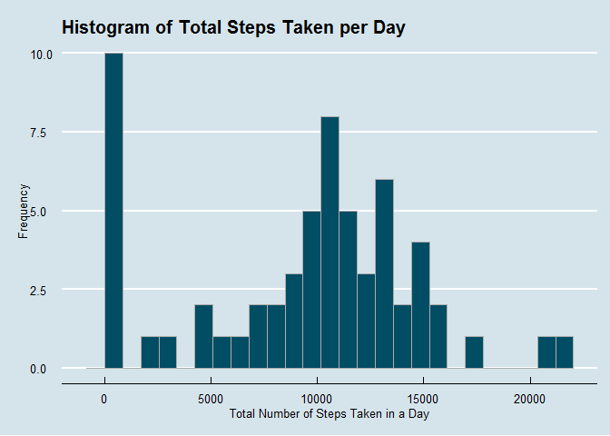
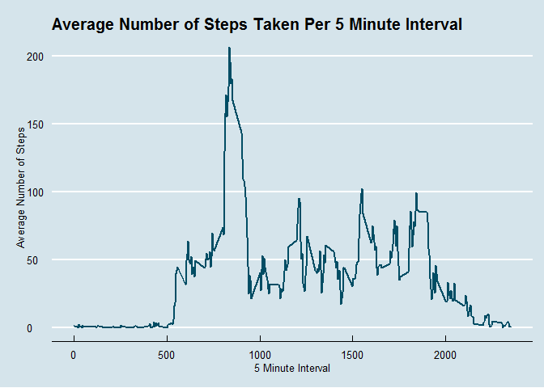
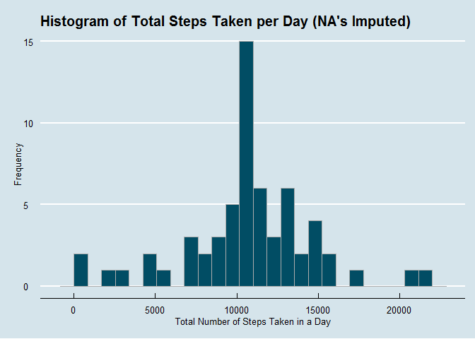
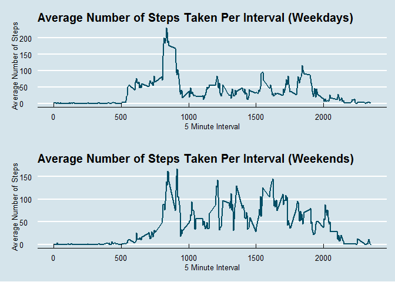

# Reproducible Research: Peer Assessment 1

# Preparing the Data and Environment

## Loading required libraries

First, we want to load the libraries will drive the rest of our analysis.


```r
require(dplyr)
```

```
## Loading required package: dplyr
## 
## Attaching package: 'dplyr'
## 
## The following object is masked from 'package:stats':
## 
##     filter
## 
## The following objects are masked from 'package:base':
## 
##     intersect, setdiff, setequal, union
```

```r
require(lubridate)
```

```
## Loading required package: lubridate
```

```r
require(ggplot2)
```

```
## Loading required package: ggplot2
```

```r
require(ggthemes)
```

```
## Loading required package: ggthemes
```

```r
require(timeDate)
```

```
## Loading required package: timeDate
```

## Loading and preprocessing the data

The data loading is set up in such a way that, if the `activity.csv` file is not present in the working directory, it will download it nonetheless. If the csv file is not in working directory, this code will download it from the repository and extract the file to the working directory


```r
fURL <- "https://github.com/jrebane/RepData_PeerAssessment1/blob/master/activity.zip?raw=true"
zipFileName <- "./activity.zip"
csvFileName <- "./activity.csv"

if (!file.exists(csvFileName)){
        message("Downloading and unpacking zip file")
        zipFile <- download.file(url = fURL,destfile = zipFileName, mode='wb')
        unzip(zipFileName)
} else {message("Data file found in working directory")}
```

```
## Data file found in working directory
```

Next, the following code takes the `activity.csv` file, determines whether there is enough memory to read in the table and, if there is,
it reads the file into a table called `tblsteps`. It also converts the `date` column values to dates using the `ymd` function from `lubridate`.


```r
if (!exists("tblSteps")){
        ## Calculate a rough estimate of how much memory the dataset will require
        ## in memory before reading into R. Make sure your computer has enough memory
        fileSizeMb <- file.info(csvFileName)$size*1.0e-6
        memLimit <- memory.limit()
        
        ## Exit with error message if computer does not have enough memory
        if (fileSizeMb > memLimit){
                stop("Insufficient memory to read table - aborting script.")
        } else {
                message("Reading table from data file")
                tblSteps <- read.csv(file = csvFileName, header = TRUE,
                                     na.strings = "NA",
                                     colClasses = c("numeric", "character", 
                                                    "numeric"))
                tblSteps$date <- ymd(tblSteps$date)    
        }} else{ message("Using data table from memory")}
```

```
## Using data table from memory
```

# What is mean total number of steps taken per day?

## Loading the Data and Ignoring Missing Values

First, it is necessary to prepare the dataset for use in plotting by grouping and summarizing the sum of steps per day by date. This is done by leveraging the `dplyr` package as used in the code below. We used `na.rm = TRUE` here to ignore the missing values in the dataset.


```r
stepsGroupedByDate <- 
        tblSteps %>%
        group_by(date) %>%
        summarize(count = sum(steps, na.rm = TRUE))
```

## Making a histogram

Using the `ggplot2` package, we can then make a histogram of the total number of steps taken each day. The code that creates the histogram can be found below.


```r
xlab1 <- "Total Number of Steps Taken in a Day"
ylab1 <- "Frequency"
title1 <- "Histogram of Total Steps Taken per Day"
table1 <- ggplot(stepsGroupedByDate, aes(x=count)) + 
        geom_histogram(binwidth = diff(range(stepsGroupedByDate$count))/25, 
                       fill = "#014d64", colour = "#adadad") + 
        theme_economist() + 
        scale_colour_economist() + 
        xlab(xlab1) + 
        ylab(ylab1) + 
        ggtitle(title1)
```

Here is the corresponding histogram.


```r
print(table1)
```

 

## Mean and Median Number of Steps per Day

We then take the mean of the `count` column within `stepsGroupedByDate` and store that value in `meansteps`. The mean value is then printed below.


```r
meansteps <- mean(stepsGroupedByDate$count)
print(meansteps)
```

```
## [1] 9354
```

Similarly, we take the median of the `count` column within `stepsGroupedByDate` and store that value in `mediansteps`. The median value is then printed below.


```r
mediansteps <- median(stepsGroupedByDate$count)
print(mediansteps)
```

```
## [1] 10395
```

# What is the average daily activity pattern?

Before we delve into creating the time series plot, we create a dataset to draw from which comprises the mean numbers of steps by interval, with NA values removed. By leveraging the `dplyr` package again, we are able to create the corresponding data frame `stepsGroupedByInterval` with the code below.


```r
stepsGroupedByInterval <- 
        tblSteps %>%
        group_by(interval) %>%
        summarize(average = mean(steps, na.rm = TRUE))
```

## Time Series Plot

Using `ggplot2`, we can plot the average number of steps per five minute interval that we collected into the `stepsGroupByInterval` object.


```r
xlab2 <- "5 Minute Interval"
ylab2 <- "Average Number of Steps"
title2 <- "Average Number of Steps Taken Per 5 Minute Interval"
table2 <- ggplot(stepsGroupedByInterval, aes(x=interval, y=average)) + 
        geom_line(colour = "#014d64", size = 0.75) + 
        theme_economist() + 
        scale_colour_economist() + 
        xlab(xlab2) + 
        ylab(ylab2) + 
        ggtitle(title2)
```

And here is the corresponding time series plot.


```r
print(table2)
```

 

## 5 Minute Interval Max

Using the code below, we can find the row showing the interval with the maximum number of average steps.


```r
stepsMax <- stepsGroupedByInterval[which.max(stepsGroupedByInterval$average),]
print(stepsMax)
```

```
## Source: local data frame [1 x 2]
## 
##   interval average
## 1      835   206.2
```

# Imputing missing values

## Calculate and report the total number of missing values in the dataset

The calculation to determine the total number of missing values in the dataset is relatively straightforward, simply summing the NA values in the `steps` column of `tblSteps`.


```r
sum(is.na(tblSteps$steps))
```

```
## [1] 2304
```

## Devise a strategy for filling in all of the missing values in the dataset.

The strategy that we will use to fill in all of the missing values is to replace the missing value with the mean value for that 5-minute interval. This decision was based on the hypothesis that the values may vary more over the course of the day than by the interval. That is to say, if there is an NA at 2:00 AM, it is more likely that the actual value at that time would be that of the average value at 2:00 AM everyday as opposed to the average value of that given day.

## Create a new dataset that is equal to the original dataset but with the missing data filled in

The following code executes on the strategy outlined above and creates a new dataset `tblSteps2` with imputed values filled in for the NA values.


```r
tblSteps2 <- tblSteps

tblSteps2$steps[is.na(tblSteps$steps)] <- 
        ave(tblSteps$steps, 
        tblSteps$interval, 
        FUN=function(x) mean(x, na.rm = TRUE)) [is.na(tblSteps$steps)]
```

## Make a histogram of the total number of steps taken each day

With this new dataset created, the process of developing a histogram is similar to the previous process.


```r
stepsGroupedByDate2 <- 
        tblSteps2 %>%
        group_by(date) %>%
        summarize(count = sum(steps, na.rm = TRUE))

xlab3 <- "Total Number of Steps Taken in a Day"
ylab3 <- "Frequency"
title3 <- "Histogram of Total Steps Taken per Day (NA's Imputed)"
table3 <- ggplot(stepsGroupedByDate2, aes(x=count)) + 
        geom_histogram(binwidth = diff(range(stepsGroupedByDate2$count))/25, 
                       fill = "#014d64", colour = "#adadad") + 
        theme_economist() + 
        scale_colour_economist() + 
        xlab(xlab3) + 
        ylab(ylab3) + 
        ggtitle(title3)

print(table3)
```

 

##Calculate and report the mean and median total number of steps taken per day.

We can now take the mean of the `count` column within `stepsGroupedByDate2` and store that value in `meansteps2`. The mean value is then printed below.


```r
meansteps2 <- mean(stepsGroupedByDate2$count)
print(meansteps2)
```

```
## [1] 10766
```

Similarly, we can take the median of the `count` column within `stepsGroupedByDate2` and store that value in `mediansteps2`. The median value is then printed below.## 4. b) Median Number of Steps per Day


```r
mediansteps2 <- median(stepsGroupedByDate2$count)
print(mediansteps2)
```

```
## [1] 10766
```

## Do these values differ from the estimates from the first part of the assignment? 

There are two steps to determine the answer to this question. First, we must determine the difference in the mean, and then we must determine the difference in the median.

As you can see from the calculation below, the values for the mean do differ.


```r
diffmean <- meansteps2 - meansteps
print(diffmean)
```

```
## [1] 1412
```

Also, as you can see from the calculation below, the values for the median differ too.


```r
diffmedian <- mediansteps2 - mediansteps
print(diffmedian)
```

```
## [1] 371.2
```


## What is the impact of imputing missing data on the estimates of the total daily number of steps?

Based on the calculations above, the mean and median of the daily number of steps increased by 1412 and 371.2 accordingly. Interestingly, whereas the mean and median were different numbers when `NA` values were omitted, this time around the mean and median are identical (10766).

One could hypothesize that this is a result of the addition of the new imputed values that are, themselves, calculate on set means.

# Are there differences in activity patterns between weekdays and weekends?

## Create a new factor variable in the dataset with two levels - "weekday" and "weekend"

For this, I created a new function, `weekdayorweekend()` which would check if a given date was a weekend (using the `isWeekday` function from the `timeDate` package). I then created a new dataset called `withdates` by mutating `tblSteps2` and adding a new column using the `weekdayorweekend()` function.

From there, I split the dataset into two separate data frames, `weekdaysonly` and `weekendsonly` to facilitate charting.


```r
weekdayorweekend <- function(x) {
        ifelse(isWeekday(x), "Weekday", "Weekend")
}

withdates <- mutate(tblSteps2, daytype = weekdayorweekend(date))

weekdaysonly <- filter(withdates, daytype == "Weekday")

weekendsonly <- filter(withdates, daytype == "Weekend")
```

## Make a panel plot

The three steps to making a panel plot for this assignment are:
1. Create the weekday plot
2. Create the weekened plot
3. Merge the plots into a panel plot

First, using a similar technique as before, we create the weekday plot.


```r
weekdaySteps <- 
        weekdaysonly %>%
        group_by(interval) %>%
        summarize(average = mean(steps, na.rm = TRUE))

xlab4 <- "5 Minute Interval"
ylab4 <- "Average Number of Steps"
title4 <- "Average Number of Steps Taken Per Interval (Weekdays)"
table4 <- ggplot(weekdaySteps, aes(x=interval, y=average)) + 
        geom_line(colour = "#014d64", size = 0.75) + 
        theme_economist() + 
        scale_colour_economist() + 
        xlab(xlab4) + 
        ylab(ylab4) + 
        ggtitle(title4)        
```

Then, in a similar fashion again we create the weekend plot.


```r
weekendSteps <- 
        weekendsonly %>%
        group_by(interval) %>%
        summarize(average = mean(steps, na.rm = TRUE))

xlab5 <- "5 Minute Interval"
ylab5 <- "Average Number of Steps"
title5 <- "Average Number of Steps Taken Per Interval (Weekends)"
table5 <- ggplot(weekendSteps, aes(x=interval, y=average)) + 
        geom_line(colour = "#014d64", size = 0.75) + 
        theme_economist() + 
        scale_colour_economist() + 
        xlab(xlab5) + 
        ylab(ylab5) + 
        ggtitle(title5)        
```

For the multiple plot function, I have imported the `multiplot()` function from [*Cookbook for R*](http://www.cookbook-r.com/Graphs/Multiple_graphs_on_one_page_(ggplot2)/) which provides a crisp solution to generating panel plots for `ggplot2` plots.


```r
# ggplot objects can be passed in ..., or to plotlist (as a list of ggplot objects)
# - cols:   Number of columns in layout
# - layout: A matrix specifying the layout. If present, 'cols' is ignored.
#
# If the layout is something like matrix(c(1,2,3,3), nrow=2, byrow=TRUE),
# then plot 1 will go in the upper left, 2 will go in the upper right, and
# 3 will go all the way across the bottom.
#
multiplot <- function(..., plotlist=NULL, file, cols=1, layout=NULL) {
        require(grid)
        
        # Make a list from the ... arguments and plotlist
        plots <- c(list(...), plotlist)
        
        numPlots = length(plots)
        
        # If layout is NULL, then use 'cols' to determine layout
        if (is.null(layout)) {
                # Make the panel
                # ncol: Number of columns of plots
                # nrow: Number of rows needed, calculated from # of cols
                layout <- matrix(seq(1, cols * ceiling(numPlots/cols)),
                                 ncol = cols, nrow = ceiling(numPlots/cols))
        }
        
        if (numPlots==1) {
                print(plots[[1]])
                
        } else {
                # Set up the page
                grid.newpage()
                pushViewport(viewport(layout = grid.layout(nrow(layout), 
                                                           ncol(layout))))
                
                # Make each plot, in the correct location
                for (i in 1:numPlots) {
                        # Get the i,j matrix positions of the regions that 
                        #contain this subplot
                        matchidx <- as.data.frame(which(layout == i, arr.ind = 
                                                                TRUE))
                        
                        print(plots[[i]], vp = viewport(layout.pos.row = 
                                                                matchidx$row,
                                                        layout.pos.col = 
                                                                matchidx$col))
                }
        }
}
```

After that function is imported, it is smooth sailing from here. We simply call the `multiplot()` function on the tables we put together and, voila, the panel plot is created!


```r
multiplot(table4, table5, cols=1)
```

```
## Loading required package: grid
```

 
